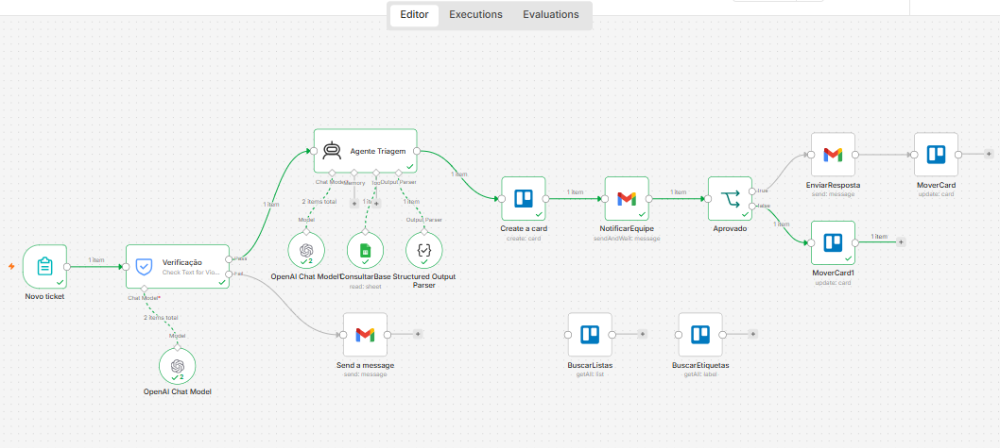
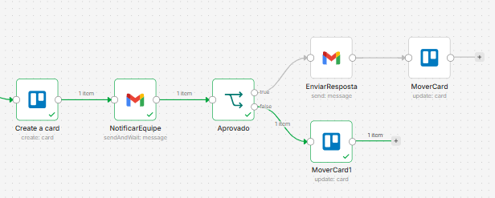
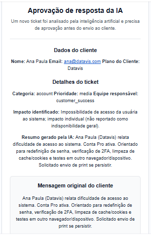
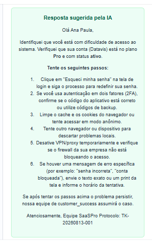
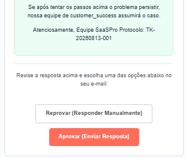
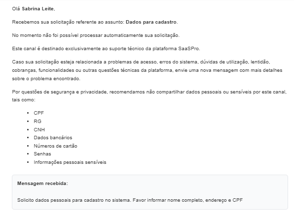
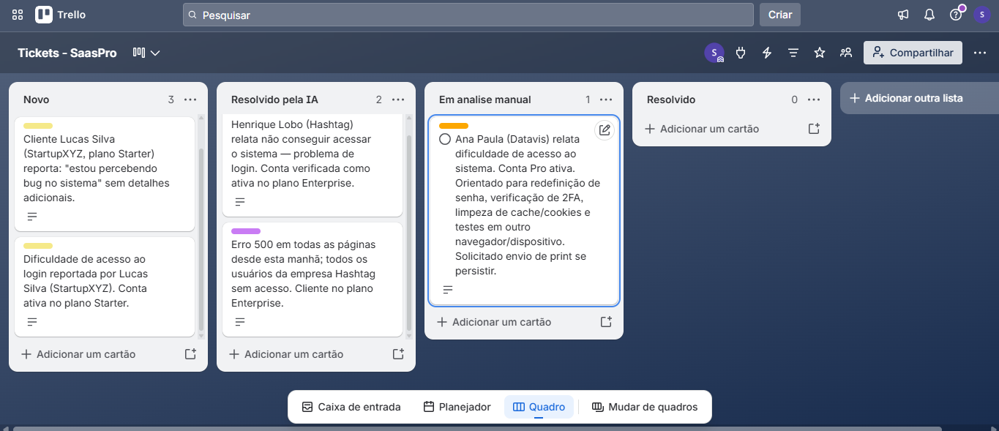

# 🤖 SaaSPro – Intelligent Ticket Triage and Support Automation

Sistema de automação de suporte baseado em Inteligência Artificial desenvolvido com n8n, OpenAI, Gmail, Trello e Google Sheets.

## 🎯 Objetivo

Automatizar o recebimento, classificação e tratamento inicial de tickets de suporte técnico utilizando Inteligência Artificial, reduzindo o tempo de triagem, padronizando respostas e aumentando a eficiência operacional.

## 📌 Sobre o Projeto

Este projeto demonstra a construção de um fluxo completo de atendimento automatizado com IA para triagem de tickets de suporte.

A solução é capaz de:

- Identificar solicitações válidas de suporte
- Consultar informações de clientes
- Classificar prioridade e categoria
- Gerar respostas automáticas
- Solicitar aprovação humana
- Registrar e acompanhar tickets no Trello

## ⚙️ Funcionalidades

- Classificação automática de tickets
- Definição automática de prioridade
- Encaminhamento por equipe responsável
- Consulta de clientes em base corporativa
- Resposta automática gerada por IA
- Aprovação humana antes do envio
- Integração com Gmail
- Integração com Trello
- Controle de prioridades via etiquetas
- Tratamento de assuntos fora do escopo
- Orientação LGPD para conteúdos sensíveis

# 🏗️ Arquitetura da Solução

## 🔄 Workflow Completo



Fluxo principal desenvolvido no n8n para triagem inteligente de tickets utilizando Inteligência Artificial e aprovação humana.

## 🔍 Visão Geral

O sistema automatiza a triagem inicial de tickets de suporte utilizando Inteligência Artificial, validação de clientes e aprovação humana antes do envio ao usuário.

## 🧩 Componentes

### 📧 Gmail

Recebe solicitações de suporte via e-mail.

### 🔄 n8n

Orquestra todo o fluxo de automação.

### 🤖 OpenAI

Classifica o ticket, identifica prioridade, equipe responsável e gera respostas sugeridas.

### 📊 Google Sheets

Base corporativa utilizada para validação de clientes.

### 📋 Trello

Centraliza o gerenciamento operacional dos tickets.

## 🔀 Fluxo Técnico

1. Cliente envia e-mail.
2. Sistema verifica se o assunto pertence ao suporte.
3. Consulta a base corporativa.
4. IA classifica:
   - Categoria
   - Prioridade
   - Equipe responsável
5. Card é criado no Trello.
6. E-mail de aprovação é enviado para a equipe.
7. Analista:
   - Aprova
   - Reprova
8. Sistema:
   - Envia resposta ao cliente
   - Ou encaminha para análise manual.

## 📸 Evidências de Execução

### 👤 Aprovação Humana



A resposta gerada pela IA é enviada para validação antes do envio ao cliente.

O analista recebe:

- Resumo do ticket
- Classificação da IA
- Resposta sugerida
- Botões de Aprovação e Reprovação

### 📧 Dados do Ticket



Informações consolidadas do chamado analisado pela IA.

### 🤖 Resposta Gerada pela IA



Exemplo de resposta construída automaticamente com base na análise do ticket.

### ✅ Aprovação para Envio



Validação humana obrigatória antes da comunicação com o cliente.

### 🚫 Assunto Fora do Escopo



Quando a solicitação não corresponde ao suporte técnico, o sistema envia automaticamente uma resposta orientativa.

### 📋 Gestão Operacional no Trello



Todos os tickets são registrados automaticamente no Trello para acompanhamento operacional e priorização.

## 🚀 Benefícios

- Redução do tempo de triagem
- Padronização das respostas
- Governança operacional
- Aprovação humana obrigatória
- Priorização automática
- Integração entre múltiplas plataformas
- Escalabilidade do processo de atendimento

## 🧠 Fluxo Lógico

```text
Novo Ticket
     │
     ▼
Verificação
     │
 ┌───┴────┐
 │        │
Aprovado  Reprovado
 │         │
 ▼         ▼
Agente IA  Email Orientativo
 │
 ▼
Consulta Base Clientes
 │
 ▼
Criação do Card no Trello
 │
 ▼
Aprovação Humana
 │
 ┌───┴────┐
 │        │
Aprovar   Reprovar
 │         │
 ▼         ▼
Cliente   Análise Manual
```

## 🛠️ Stack Tecnológica

- n8n
- OpenAI GPT
- Gmail API
- Trello API
- Google Sheets
- HTML
- JSON

## 🧪 Cenários Testados

### 🎫 Ticket Técnico

- Classificação correta
- Resposta automática
- Aprovação humana

### 🚨 Ticket Crítico

- Priorização crítica
- Escalonamento automático

### 🚫 Assunto Fora do Escopo

- Bloqueio pelo guardrail
- E-mail orientativo ao usuário

### 🔒 LGPD

- Orientação para não envio de dados sensíveis
- Tratamento preventivo de informações sensíveis

## 📁 Estrutura do Projeto

```text
saaspro-ai-ticket-triage/
│
├── README.md
├── LICENSE
│
├── docs/
│   ├── workflow-overview.png
│   ├── ai-triage-engine.png
│   ├── human-approval-flow.png
│   ├── trello-board.png
│   ├── gmail-approval-email1.png
│   ├── gmail-approval-email2.png
│   ├── gmail-approval-email3.png
│   ├── gmail-rejected-email.png
│   ├── Triagem de tickets de IA com aprovação humana.json
│   │
│   └── workflow/
```

## 👩‍💻 Autor

**Sabrina Leite de Sá**

Analista de Dados | Business Intelligence | Automação com IA

**Tecnologias e Competências**

- Power BI
- SQL
- Python
- n8n
- OpenAI
- ETL
- Analytics
- Automação de Processos

💼 LinkedIn: https://www.linkedin.com/in/sabrinaleitedesa/

💻 GitHub: https://github.com/sabbrinaa-cloud

🌐 Portfólio: https://sites.google.com/edu.senai.br/portfolio-sabrina-sa/in%C3%ADcio
